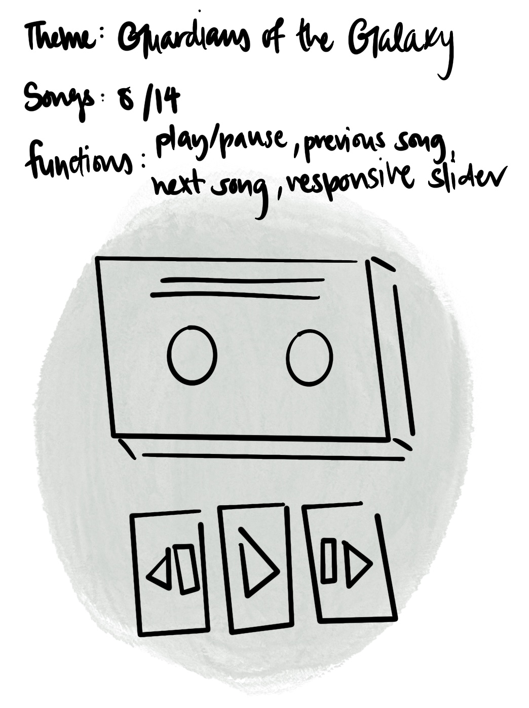

# Music Player (GOTG Vol. 3 Soundtrack)

## App Details

### Summary

- Music player featuring 8 out of 14 songs from the official Guardians of the Galaxy Vol. 3 soundtrack.

- Built with HTML, CSS and JavaScript.

- Player features: play, pause, shuffle, repeat, previous/next song.

- "Now Playing" display for better UX.

#### [Live Site](https://dororeo.github.io/AwesomeMixVol3/)

### Approach

#### MVP - Minimum Viable Product:

1. Play, pause, previous song, next song
2. Respective text displays update accordingly (song title & artist)
3. Responsive slider (update audio and timer display on click)

#### Additional Features added later

1. Repeat and Shuffle songs
2. "Now Playing" display - for users to identify number of songs in the playlist.
3. Favicon added

#### CSS and UI

1. Layout and styling (based on prototype image below)
2. Rotating cassette tape rollers when a song plays
3. Indication of active buttons (shuffle on / repeat on = colour change)
4. Animated gradient background

#### Possible Improvements

1. Volume control
2. Previous song button with shuffle on: instead of bringing users to the song played previously, it returns to "shuffle-off" mode, returning to the song before the song currently playing. (original song order) 

Awesome Mix image by [Amateur-designs](https://www.redbubble.com/people/Amateur-designs/explore?page=1&sortOrder=top%20selling#profile).